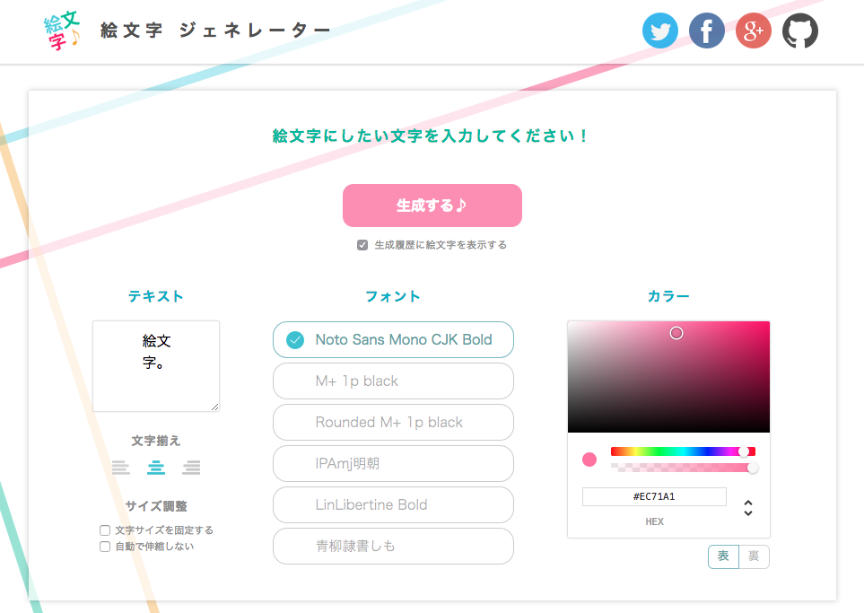

## Emoji Generator

:tada: Ultimate Emoji Generator

 

## Requirements

  - Python `$(cat .python-version)`
  - Node `$(cat .node-version)`
  - MySQL 5.7

## Libraries

- [aiohttp](https://github.com/aio-libs/aiohttp) - Server-side framework
- [Vue](https://vuejs.org/) - Frontend framework
- [Skia](https://skia.org/) - Graphics library

## Getting started

- [Server-side setup document](server/README.md)
- [Frontend setup document](frontend/README.md)

## Other platforms

- [cli](https://github.com/emoji-gen/cli) - Console application

## License
GPLv3 &copy; [Emoji Generator](https://emoji-gen.ninja)
